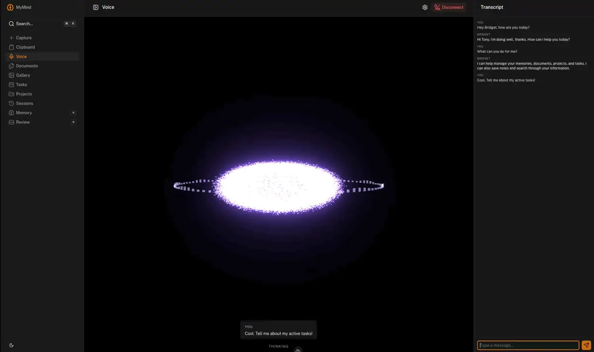

# MyMind

**A self-hosted "second brain" that's AI-native and agent-accessible.** Notes, documents, tasks, images, clipboard, memory — and a voice agent you can just *talk to* — in one place, running on my own hardware, wired into my local LLMs, and exposed to my coding agents over MCP.

I built this for me. It's the single front door to everything I'd otherwise scatter across a dozen apps: a Markdown knowledge base, a ShareX image host, a kanban, a device-sync clipboard, and a memory system that turns my AI coding sessions into durable, searchable notes. It's also a portfolio piece — and very much a living project I'm going to keep growing.

> 🛠️ Built by Tony — more of my work at **[techhivelabs.net](https://techhivelabs.net)**.

<!-- Hero shot: the Documents page (split tree + editor in split/preview mode). -->


---

## Why it exists

Most "knowledge management" tools are either dumb buckets or someone else's cloud. I wanted one that:

- **Runs entirely on my homelab** — my data, my GPUs, no subscription, exposed to the internet only where *I* choose (document/image sharing).
- **Uses local AI for real work** — embeddings, OCR, transcription, and memory extraction all run against models on my own rig.
- **Is reviewable, never silently "magic"** — the AI proposes; I approve. Nothing auto-mutates my corpus.
- **Talks to my agents** — an MCP server lets Claude Code (and friends) search my memories/docs and create tasks directly.

It's modular by design — each system is its own page, and there's always room for the next one.

## What it does

### 📄 Documents — a Markdown knowledge base with a real editor
A split file-tree + editor (CodeMirror + live MDC preview), drag-and-drop organize, right-click rename/move/share, a markdown toolbar, and **custom MDC components** (callouts, notes, collapsibles). Paste an image straight into a doc and it uploads + embeds itself. Share any document as a public read-only page with one click.

### 🔎 Search that actually understands you
One **⌘K command palette** searches across *everything* — documents, memories, image OCR/tags, tasks, projects — using **hybrid semantic + keyword search** (pgvector embeddings fused with trigram matching). Find the thing by what it *means*, not just the words you remember.

### 🧠 Memory — your AI sessions become durable knowledge
Claude Code / Hermes hooks stream session transcripts in; a background job extracts **atomic, deduplicated memories** ("the user prefers pnpm", "this project uses Drizzle + pgvector") with confidence scores. High-confidence memories auto-file; the rest land in a review queue. Browse the raw transcripts too — token usage, tool calls, the works.

### 🎙️ Voice — talk to your second brain
A full hands-free agent, **100% self-hosted**: Silero VAD in the browser, faster-whisper STT and Kokoro/Chatterbox TTS on my rig, and the same agent core (with all its tools) in between. Barge-in works — interrupt it mid-sentence and it stops and listens. Typed messages run through the same loop and get spoken replies. The whole thing is fronted by a **GPU-particle reactor** (Three.js, 50k particles in a custom vertex shader) that breathes when idle, dances with your mic, collapses into a lightning-laced vortex while thinking, and erupts with the reply — plus a settings panel with a *live mic-probability meter* for tuning VAD sensitivity to your room.



### 🤖 An MCP server for your agents
MyMind exposes 11 tools over the Model Context Protocol — `search_memories`, `save_memory`, `search_docs`, `create_task`, `search/edit projects & tasks`. Point a coding agent at it and it can read your knowledge and write back to it, securely, with an API token.

### 🖼️ Image host + quick capture
A **ShareX/CleanShot-compatible uploader** (`POST /api/upload`) that auto-converts to WebP, runs **OCR + tag suggestions** via a local vision model, and serves public or private links. Quick Capture lets you paste/drag/snap a photo — including **transcribing handwritten notes into clean Markdown** with an inferred title.

### 🗂️ Projects — everything rolls up to the work it belongs to
**Canonical projects** keyed on the git remote, so the same repo cloned to many machines/paths resolves to one identity. Sessions, memories, **documents**, and tasks all associate to a project, and a per-project **dashboard** (`/projects/[slug]`) shows its git remote, links, aliases, and live tabs of everything tied to it. Documents file under `/projects/<slug>/…` (the path *is* the association); the `/input` enricher auto-classifies new notes into the right project. Slugs are renameable (cascades everywhere) and duplicate projects can be **merged** (fold a legacy label project into its git-keyed twin in one click).

### ✅ Tasks, 📋 Clipboard, 📈 Activity, and more
A drag-and-drop kanban with projects/priorities; a **device-sync clipboard** (paste on one machine, grab it on another, live over SSE, with per-message machine attribution); an **activity log** with a live trace-tree of every model call, agent action, and background job (+ email alerts). Everything that lands in the inbox (`/input`) gets auto-enriched and filed. The whole UI is **live across devices** — changes stream over SSE and refetch without a manual refresh.

## Screenshots

> Drop images into `docs/screenshots/`. Suggested set:

| | |
|---|---|
|  **⌘K search across everything** |  **Image host + OCR tags** |
|  **Tasks board** |  **Memory review** |
|  **Session transcripts** |  **Device-sync clipboard** |

## How it works

One **Nuxt 4** service does all of it — the web app (SPA), the HTTP API, and the MCP server, from a single deployable.

```
   Browser (SPA + mic)       ShareX / CleanShot        Claude Code / agents
        │  ⇅ voice WS              │                          │
        ▼                          ▼                          ▼
  ┌───────────────────────────────────────────────────────────────┐
  │                     Nuxt 4  ·  Nitro server                    │
  │  web UI · /api/* (upload, hooks, docs…) · /api/voice/ws ·      │
  │  /api/mcp · agent core (AI SDK runAgent: voice, chat, tools)   │
  └───────────────────────────────────────────────────────────────┘
        │                        │                          │
        ▼                        ▼                          ▼
  Postgres + pgvector      local AI rig (LAN)         object storage
  docs · memories ·     embeddings · vision/OCR ·     (local disk / S3)
  tasks · sessions      reasoning · STT · TTS
```

- **Storage**: PostgreSQL + **pgvector** (HNSW) for hybrid search; content-addressed blob storage for images/files.
- **AI**: a **DB-backed model registry** (edited in-app at `/settings`) maps each usage — reasoning, embeddings, vision/OCR, STT, TTS, rerank — to an OpenAI-spec endpoint (mostly my local rig, with hosted fallbacks for hard reasoning). Swap or add a model in the UI; never a code change or redeploy.
- **Background work**: in-process scheduled jobs embed documents, run OCR, propose frontmatter, and extract memories on a cadence.
- **Auth**: single-user sessions for the web app; bearer API tokens for machine clients (ShareX, hooks, MCP).

It was built deliberately, one system at a time — there's a full paper trail in [`docs/`](docs/) (a cross-cycle roadmap, per-system specs, handovers, and a living wiki).

## Tech stack

**Nuxt 4** · **Nuxt UI v4** · **Nitro** · **Drizzle ORM** · **PostgreSQL 16 + pgvector** · **better-auth** · **CodeMirror 6** · **Nuxt MDC** · **sharp** · **@modelcontextprotocol/sdk** · **Vercel AI SDK** · **Three.js** (custom GLSL) · **Silero VAD** (`vad-web`) · local **Qwen3** models (embeddings / vision / reasoning) + **faster-whisper** STT + **Kokoro/Chatterbox** TTS via OpenAI-spec endpoints.

## Running it yourself

It's designed for a homelab (Proxmox + Docker) with access to local LLM endpoints. There's a complete, no-assumptions deployment guide:

➡️ **[docs/DEPLOYMENT.md](docs/DEPLOYMENT.md)** — Docker setup, env vars, bootstrapping, reverse proxy, backups, and verification.

```bash
cp .env.example .env          # configure DB, auth, AI endpoints
docker compose -f docker-compose.prod.yml up -d --build
```

CI/CD is wired up too: every push runs the test suite, and pushes to `master` auto-deploy via a self-hosted GitHub Actions runner (see [`.github/workflows/`](.github/workflows/)).

> Heads-up: the AI features expect OpenAI-compatible model endpoints (mine are local Qwen3 models). Configure them in-app at `/settings` — the `AI_*` env vars are just one-time onboarding seeds; any compatible provider works.

## Status & roadmap

Actively built and in daily use — 27 build cycles shipped so far (foundation → AI enrichment → capture/images → tasks → memory + MCP → clipboard → polish → a DB-backed AI model registry → the self-hosted voice agent + GPU-particle visualizer → CI/CD deploy → image-enrichment pipeline → live cross-device reactivity → activity-log observability → bridget-parity session import + semantic session/message search → and a full **projects** system: canonical git-keyed projects, a per-project dashboard, document/session/memory association, and project merge). The full status table lives in [`docs/superpowers/plans/00-roadmap.md`](docs/superpowers/plans/00-roadmap.md); what's left is reconciled in [`docs/BACKLOG.md`](docs/BACKLOG.md).

On the radar: a full **text-chat UI** on the agent core, a richer **agent loop** with more **MCP tools** for my coding agents, deeper **scoped memory/knowledge**, streaming STT partials (live captions), GitHub-commit → memory, and whatever else I decide my brain needs next.

## A note

This is a personal project — opinionated, single-user, and shaped entirely around how *I* work. I'm sharing it because I think the architecture is genuinely interesting (local-AI-native, agent-accessible, review-gated), not because it's a polished product for everyone. Poke around, steal ideas, and say hi.

— **[Tony · Tech Hive Labs](https://techhivelabs.net)**
